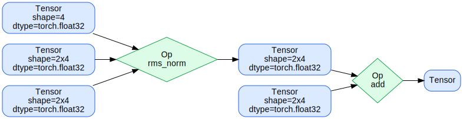

# cutest

Something cute

Basic example:

```python
import torch
from pathlib import Path

from cutest import RMSNorm, Tensor, visualize_graph

x = Tensor(torch.randn(2, 4))
weight = Tensor(torch.randn(4))
bias = Tensor(torch.randn(2, 4))
bias2 = Tensor(torch.randn(2, 4))

norm = RMSNorm(weight, bias)(x)
output = norm + bias2
```

Example graph:


