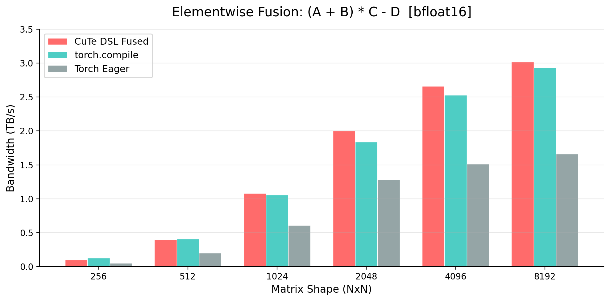

# cutest

Something cute

Elementwise kernel fuser built on NVIDIA CuTe DSL. Traces a computation graph and generates a single fused CUDA kernel.

`(A + B) * C - D` fused into one kernel, bfloat16, benchmarked against `torch.compile` and PyTorch eager on H100.
